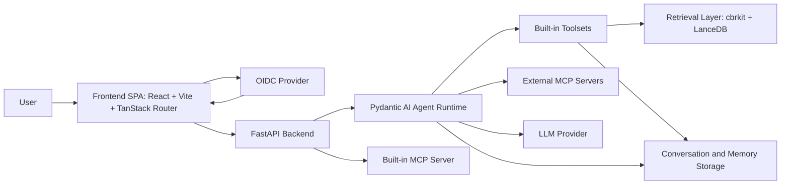
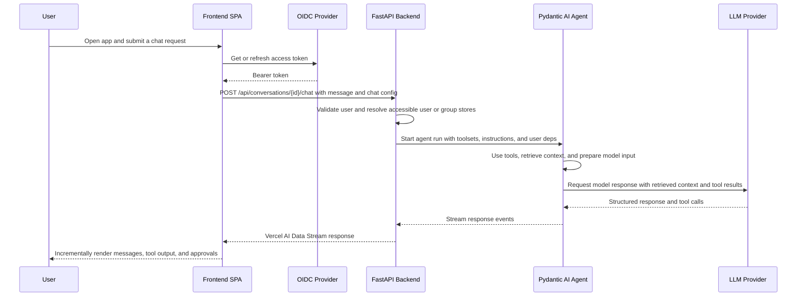
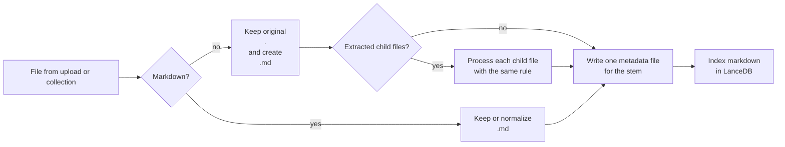

# Architecture

- Hivegent uses a React SPA in the frontend and a FastAPI service in the backend.
- The core workflow is retrieval-augmented chat over uploaded and processed documents.
- The frontend owns authentication, interaction, local state, and transport handling.
- The backend owns execution, storage, security, retrieval, and model integration.

## Frontend

- Built with React 19, TypeScript, and Vite as a client-side SPA.
- Uses TanStack Router for file-based routes and login-gated pages.
- Uses `oidc-spa` for browser-side OIDC authentication and mock auth in development.
- Uses the Vercel AI SDK for chat transport and streaming UI.
- Uses Zustand for client state and Zod for runtime boundary validation.
- Uses Tailwind CSS 4 and shadcn-style UI components for presentation.
- Organizes the UI around a chat workspace and a document workspace.

## Backend

- Built with FastAPI as a single HTTP application.
- Exposes authenticated REST endpoints, chat streaming endpoints, SSE progress endpoints, and a built-in MCP endpoint.
- Uses Pydantic and `pydantic-settings` for schemas and environment-driven configuration.
- Enforces authentication through OIDC bearer tokens or personal access tokens.
- Uses Pydantic AI to bind models, user-scoped dependencies, and toolsets into one runtime.
- Processes uploaded files into recursive stem-based workspace entries, chunks searchable markdown companions, stores per-entry metadata, and refreshes retrieval indexes.
- Uses LanceDB and cbrkit for dense, sparse, and hybrid retrieval.
- Stores each user or group casebase under `data/workspace/<store_key>/`, keyed by the same `user:<id>` / `group:<id>` token used by SQL and LanceDB.
- Persists conversations and long-term memory separately from the retrieval index.
- Mounts a FastMCP server at `/mcp` and can also connect to external MCP servers.

## Integration

- Uses authenticated REST for standard CRUD operations.
- Uses the Vercel AI Data Stream Protocol for chat responses.
- Uses Server-Sent Events for long-running ingestion and bulk workflows.
- Sends bearer tokens from the browser OIDC session on API and chat requests.
- Sends chat configuration such as model overrides, reasoning effort, filters, and tool settings with each chat request.
- Resolves each chat request into a user-scoped agent run on the backend.
- Uses Zod on the frontend and Pydantic on the backend to keep request and response boundaries explicit.

## Architectural Overview

- The frontend stays thin and defers business execution to the backend.
- The backend is the composition root for auth, retrieval, tool use, and model execution.
- The retrieval layer is an internal backend subsystem rather than a separate service.
- The built-in toolsets are grouped into stable categories that shape how the agent operates.

| Category       | Role                                                                         | Available tools                                                                                                                 |
| -------------- | ---------------------------------------------------------------------------- | ------------------------------------------------------------------------------------------------------------------------------- |
| `explore`      | Read-only access to user and group documents, chunks, and search.            | `list_documents`, `glob_documents`, `grep`, `semantic_search`, `get_document_lines`, `get_document`, `list_chunks`, `get_chunk` |
| `subagent`     | Lightweight delegated exploration over documents, conversations, or the web. | `explore_documents`, `explore_conversations`, `explore_web`                                                                     |
| `write`        | User-approved document modification in the workspace.                        | `edit_document`, `write_document`                                                                                               |
| `memory`       | Persistent cross-conversation memory updates.                                | `save_memory`                                                                                                                   |
| `web`          | Direct web lookup and page retrieval.                                        | `web_search`, `web_fetch`                                                                                                       |
| `conversation` | Access to persisted conversation history.                                    | `list_conversations_tool`, `query_conversations`                                                                                |

## Communication Flow

- Chat uses a streaming request-response loop between the frontend, backend, agent runtime, and LLM provider.
- Ingestion uses REST plus SSE for incremental progress updates.
- Ingested content feeds the same backend retrieval path that the agent uses during chat.

## Asset Processing

- Asset handling follows one recursive stem-based rule.
- Markdown stays as `<stem>.md`.
- Every non-markdown file keeps its original file as `<stem>.<ext>` and gets a markdown companion `<stem>.md`.
- Convertible files may also create `<stem>.assets/`, and every extracted child file is processed the same way again.
- The app shows one logical entry per stem, indexes markdown companions for retrieval, and keeps metadata outside the workspace.
- Generated image and asset-description markdown always uses chunking pipeline `none`.

