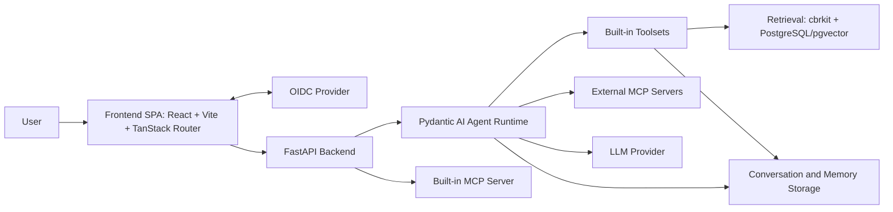
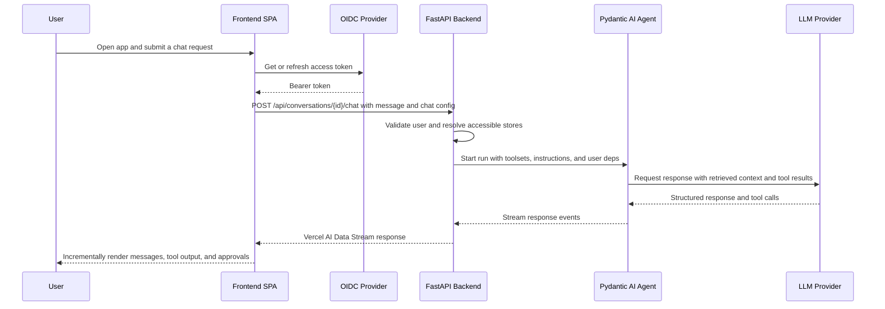

# Architecture

How the pieces fit together, for people working on the code.
For the user-facing view see [`docs/src/en/architecture.md`](docs/src/en/architecture.md); the design decisions behind each half live in [`backend/README.md`](backend/README.md) and [`frontend/README.md`](frontend/README.md).

Hivegent is a React SPA over a FastAPI service, and the core workflow is retrieval-augmented chat over uploaded and processed documents.
The frontend owns authentication, interaction, local state, and transport; the backend owns execution, storage, security, retrieval, and model integration, and is the composition root for all four.

```mermaid
flowchart LR
    end_user[User]
    frontend_spa[Frontend SPA: React + Vite + TanStack Router]
    oidc_provider[OIDC Provider]
    fastapi_backend[FastAPI Backend]
    agent_runtime[Pydantic AI Agent Runtime]
    toolsets[Built-in Toolsets]
    external_mcp[External MCP Servers]
    built_in_mcp[Built-in MCP Server]
    retrieval[Retrieval: cbrkit + PostgreSQL/pgvector]
    storage[Conversation and Memory Storage]
    llm_provider[LLM Provider]

    end_user --> frontend_spa
    frontend_spa <--> oidc_provider
    frontend_spa --> fastapi_backend
    fastapi_backend --> agent_runtime
    fastapi_backend --> built_in_mcp
    agent_runtime --> toolsets
    agent_runtime --> external_mcp
    agent_runtime --> llm_provider
    agent_runtime --> storage
    toolsets --> retrieval
    toolsets --> storage
```

## Frontend

- React 19, TypeScript, and Vite as a client-side SPA.
- TanStack Router for file-based routes and login-gated pages.
- `oidc-spa` for browser-side OIDC authentication, with mock auth in development.
- Vercel AI SDK for chat transport and streaming UI.
- Zustand for client state and Zod for runtime boundary validation.
- Tailwind CSS 4 and shadcn-style components for presentation.
- The UI is organized around a chat workspace and a document workspace.

## Backend

- FastAPI as a single HTTP application, exposing authenticated REST, chat streaming, SSE progress, and a built-in MCP endpoint.
- Pydantic and `pydantic-settings` for schemas and environment-driven configuration.
- Authentication through OIDC bearer tokens or personal access tokens, with group membership read from the OIDC groups claim.
- Pydantic AI binds models, user-scoped dependencies, and toolsets into one runtime.
- Uploads become recursive stem-based workspace entries whose markdown companions are chunked and indexed.
- PostgreSQL with `pgvector` and cbrkit for dense, sparse, and hybrid retrieval, plus conversations and long-term memory.
- Each user or group casebase lives under `data/workspace/<store_key>/`, keyed by the same `user:<id>` / `group:<id>` token that scopes SQL rows.
- Each chat conversation owns a working folder under `data/tmp/<conversation_id>/`, outside every workspace, which its agent run addresses as `/tmp` and writes without approval.
- A FastMCP server is mounted at `/mcp`, and external MCP servers can be connected.

## Integration

- Authenticated REST for CRUD on documents, conversations, and settings.
- Vercel AI Data Stream Protocol for chat responses, Server-Sent Events for ingestion progress and workspace change notifications.
- Bearer tokens from the browser OIDC session on every API and chat request.
- Chat configuration (model overrides, reasoning effort, filters, tool settings) travels with each chat request and resolves into a user-scoped agent run.
- Zod on the frontend and Pydantic on the backend keep request and response boundaries explicit.
- The interface language (English or German) is the browser's, fixed at page load, and travels as `Accept-Language` on every request and selects the language of backend error details, job titles, and the agent's instructions, while labels of fixed option values such as pipelines live in the frontend catalog.

```mermaid
sequenceDiagram
    participant end_user as User
    participant frontend_spa as Frontend SPA
    participant oidc_provider as OIDC Provider
    participant fastapi_backend as FastAPI Backend
    participant agent as Pydantic AI Agent
    participant llm_provider as LLM Provider

    end_user->>frontend_spa: Open app and submit a chat request
    frontend_spa->>oidc_provider: Get or refresh access token
    oidc_provider-->>frontend_spa: Bearer token
    frontend_spa->>fastapi_backend: POST /api/conversations/{id}/chat with message and chat config
    fastapi_backend->>fastapi_backend: Validate user and resolve accessible stores
    fastapi_backend->>agent: Start run with toolsets, instructions, and user deps
    agent->>llm_provider: Request response with retrieved context and tool results
    llm_provider-->>agent: Structured response and tool calls
    agent-->>fastapi_backend: Stream response events
    fastapi_backend-->>frontend_spa: Vercel AI Data Stream response
    frontend_spa-->>end_user: Incrementally render messages, tool output, and approvals
```

## Agent features

Each feature bundles a toolset with the instructions that only make sense when it is active (`agents/capabilities.py`).
A feature is withheld by the chat mode it declares, by a request's `disabled_tools`, or by the operator's `settings.tools.disabled`.

| Feature        | Role                                                        | Tools                                                                                                              |
| -------------- | ----------------------------------------------------------- | ------------------------------------------------------------------------------------------------------------------ |
| `explore`      | Read-only access to documents, tables, JSON, and retrieval. | `list_documents`, `glob_documents`, `read_document`, `read_binary_document`, `query_table`, `jq`, `grep`, `search` |
| `compute`      | Python sandbox over a copy-on-write workspace mount.        | `run_python`                                                                                                       |
| `subagent`     | Delegated exploration in a fresh context.                   | `explore`                                                                                                          |
| `write`        | User-approved workspace mutation (mutating modes only).     | `write_document`, `edit_document`, `move_documents`, `delete_documents`, `apply_changes`                           |
| `memory`       | Persistent cross-conversation memory (mutating modes only). | `save_memory`                                                                                                      |
| `web`          | Direct web lookup and page retrieval.                       | `web_search`, `web_fetch`                                                                                          |
| `conversation` | Access to persisted conversation history (off by default).  | `list_conversations`, `get_conversation`                                                                           |

## Asset processing

One recursive stem-based rule covers every upload.
Markdown stays as `<stem>.md`; every other file keeps its original as `<stem>.<ext>` and gains a markdown companion `<stem>.md`.
Convertible files may also produce `<stem>.assets/`, and every extracted child is processed the same way again.
The app shows one logical entry per stem, indexes the markdown companions for retrieval, and keeps metadata outside the workspace.
Generated image and asset-description markdown always uses chunking pipeline `none`.

```mermaid
flowchart LR
    input[File from upload or collection]
    decide{Markdown?}
    markdown[Keep or normalize<br/><stem>.md]
    asset[Keep original<br/><stem>.<ext><br/>and create<br/><stem>.md]
    extracted{Extracted child files?}
    recurse[Process each child file<br/>with the same rule]
    metadata[Write one metadata file<br/>for the stem]
    index[Embed + insert into<br/>chunks (one tx)]

    input --> decide
    decide -->|yes| markdown
    decide -->|no| asset
    asset --> extracted
    extracted -->|yes| recurse
    extracted -->|no| metadata
    recurse --> metadata
    markdown --> metadata
    metadata --> index
```

Which files become entries on their own, and which stay inert on disk until uploaded or reconverted, is the policy seam described in [`backend/README.md`](backend/README.md#what-becomes-a-document).
