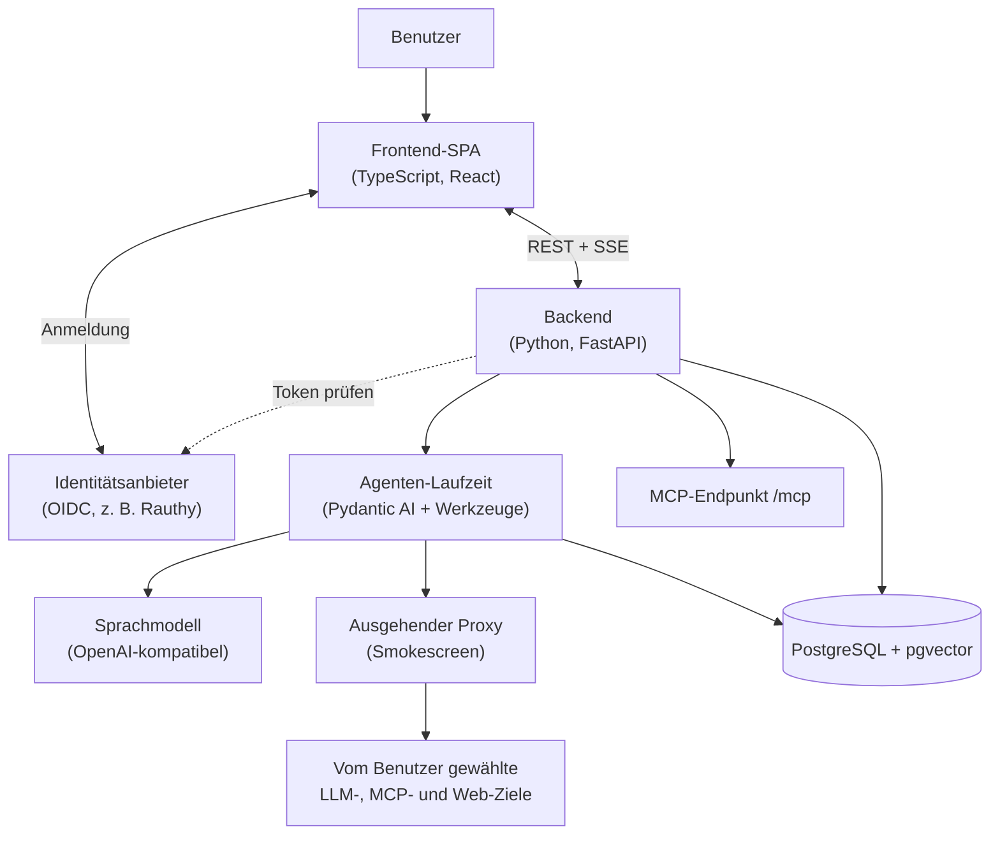

# Architektur

Hivegent ist eine Anwendung, die sich in ein Browser-Frontend und einen Backend-Dienst aufteilt, ergänzt durch eine Datenbank und einen Identitätsanbieter.
Das Frontend bleibt schlank und überlässt die eigentliche Arbeit dem Backend, das der zentrale Knotenpunkt für Anmeldung, Abruf, Werkzeugnutzung und Modellausführung ist.

## Komponenten

- Frontend: eine React-Single-Page-App, die im Browser läuft.
  Sie übernimmt die Anmeldung, den Chat- und Dokumenten-Arbeitsbereich und das Streamen der Antworten.
- Backend: ein FastAPI-Dienst, das Herzstück des Systems.
  Es authentifiziert jede Anfrage, führt den Agenten aus, übernimmt den Abruf und spricht mit dem Sprachmodell.
- Agenten-Laufzeit: aufgebaut auf Pydantic AI.
  Sie verbindet das Modell mit einer Reihe von Werkzeugen (Dokumentensuche, Lesen, Web-Abfrage, Gedächtnis, Unteragenten) und entscheidet je Anfrage, welche es nutzt.
- PostgreSQL mit der Erweiterung pgvector: der einzige Datenspeicher.
  Er enthält den Dokumentenindex, Textabschnitte und ihre Vektoren, Unterhaltungen und das Langzeitgedächtnis.
  Die Dokumentdateien selbst liegen auf der Festplatte, die Datenbank ist ein Index darüber.
- Identitätsanbieter: ein externer OIDC-Anmeldedienst wie Rauthy, Keycloak oder Authentik.
  Der Browser meldet sich dort an, das Backend prüft die ausgestellten Token, und Gruppen- sowie Administratorrechte werden aus den Token-Claims gelesen.
- Sprachmodell: ein beliebiger OpenAI-kompatibler Endpunkt, gehostet oder lokal.
- Ausgehender Proxy: Smokescreen löst jedes vom Benutzer oder Modell gewählte Ziel auf und stellt die Verbindung her, wobei private und reservierte Adressen abgelehnt werden.
  Das Backend prüft zusätzlich bei jeder Anfrage und Weiterleitung getrennte Hostnamen-Freigabelisten für Benutzer-Endpunkte und Web-Werkzeuge.
  Vom Betreiber konfigurierte Dienste verwenden direkte Clients und passieren diese Vertrauensgrenze nicht.

## Schnittstellen

- REST: Anlegen, Lesen, Aktualisieren und Löschen von Dokumenten, Unterhaltungen und Einstellungen.
- Streaming-Chat: Chat-Antworten werden über das Vercel AI Data Stream Protokoll an den Browser gestreamt, und lange Uploads melden ihren Fortschritt über Server-Sent Events.
- MCP: ein optionaler Endpunkt für das Model Context Protocol unter `/mcp` erlaubt externen Clients wie Editoren oder anderen Agenten, einen Teil der Werkzeuge von Hivegent über dieselbe Anmeldung zu nutzen.

## Bereitstellung

Das veröffentlichte Container-Image bündelt das Backend, das fertige Frontend, den eingehenden Caddy-Proxy und den ausgehenden Smokescreen-Proxy.
Eine typische Bereitstellung besteht daher aus drei Containern: der Hivegent-App, PostgreSQL und dem Identitätsanbieter.
Einzelheiten finden Sie unter [Einrichtung](setup.md).
