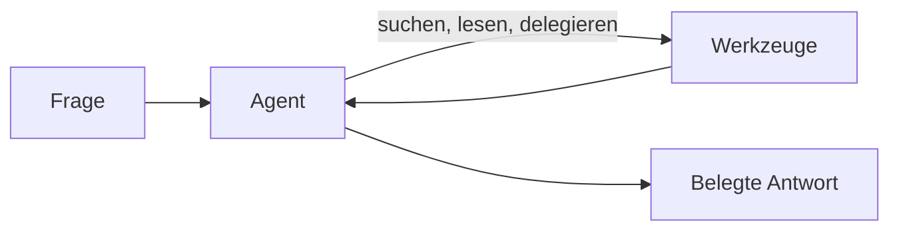

# Funktionsweise

Hivegent ist ein agentischer, abrufgestützter Assistent.
Diese Seite erklärt, was das bedeutet, wie es sich von einfacheren Aufbauten unterscheidet und welche Werkzeuge der Assistent nutzen kann.

## Drei Wege, Fragen zu Dokumenten zu stellen

**Chat mit angehängten Dateien.**
Sie hängen einige wenige Dateien an einen Chat, und das Modell liest sie direkt.
Das genügt für ein paar kurze Dokumente, skaliert aber nicht: große oder viele Dokumente passen nicht in das Kontextfenster des Modells, es gibt keine echte Suche, und das Modell sieht nur, was Sie in dieser Sitzung angehängt haben.

**Klassisches RAG.**
Eine feste Pipeline führt pro Frage eine Suche aus, fügt die am besten passenden Stellen in die Anfrage ein und antwortet in einem Zug.
Das skaliert auf große Sammlungen und belegt Antworten mit Quellen, aber der eine Abrufschritt ist die gesamte Strategie: Geht diese eine Suche daneben, leidet die Antwort, und das Modell kann nicht erneut suchen, ein ganzes Dokument lesen oder mehrere Suchen kombinieren.

**Agentisches RAG, der Ansatz von Hivegent.**
Das Modell handelt als Agent, der entscheidet, wie er die Antwort findet.
Es kann wiederholt suchen, seine Anfragen verfeinern, ganze Dokumente oder einzelne Zeilen lesen, Hinweisen nachgehen, Teilaufgaben delegieren und mehrere Schritte gehen, bevor es antwortet.
Der Abruf wird zu einem Werkzeug, das der Agent bei Bedarf einsetzt, statt zu einem festen Schritt, der einmal läuft. So bewältigt er vage oder mehrteilige Fragen und Antworten, die über viele Dokumente verstreut sind, und belegt sie weiterhin mit Quellen.

|                                 | Chat mit angehängten Dateien  | Klassisches RAG            | Agentisches RAG (Hivegent)                  |
| ------------------------------- | ----------------------------- | -------------------------- | ------------------------------------------- |
| Dokumentmenge                   | Wenige kleine Dateien         | Große Sammlungen           | Große Sammlungen                            |
| Informationssuche               | Modell liest alles Angehängte | Eine feste Suche pro Frage | Agent sucht und liest in mehreren Schritten |
| Nachfassen und Verfeinern       | Keines                        | Keines                     | Der Agent entscheidet, erneut zu suchen     |
| Quellenangaben                  | Manchmal                      | Ja                         | Ja                                          |
| Geteilte, dauerhafte Sammlungen | Nein                          | Unterschiedlich            | Ja, mit Zugriffssteuerung                   |

## Was der Assistent kann

Der Agent arbeitet mit einer Reihe von Werkzeugen, die in Werkzeuggruppen gegliedert sind, und wählt für jede Anfrage selbst, welche er nutzt.

| Werkzeuggruppe       | Was sie dem Assistenten ermöglicht                                                                           | Verfügbarkeit                |
| -------------------- | ------------------------------------------------------------------------------------------------------------ | ---------------------------- |
| Suchen und Lesen     | Ihre Dokumente nach Bedeutung oder exaktem Text durchsuchen und ganze Dokumente oder einzelne Stellen öffnen | Immer                        |
| Berechnungen         | Ein kleines Python-Programm in einer Sandbox ausführen, um Zahlen, Daten und Anzahlen zuverlässig zu ermitteln | Immer                        |
| Delegierte Erkundung | Fokussierte Unteragenten starten, die Dokumente, frühere Unterhaltungen oder das Web erkunden und berichten  | Immer                        |
| Unterhaltungsverlauf | In früheren Unterhaltungen nachsehen, um bereits Geklärtes wiederzuverwenden                                 | Immer                        |
| Gedächtnis           | Nützliche Fakten speichern, um sie in späteren Unterhaltungen abzurufen                                      | Immer                        |
| Dokumentbearbeitung  | Dokumente in Ihrem Arbeitsbereich anlegen oder bearbeiten, nach vorheriger Zustimmung                        | Immer                        |
| Web                  | Im Web suchen und Seiten abrufen                                                                             | Wenn vom Betreiber aktiviert |
