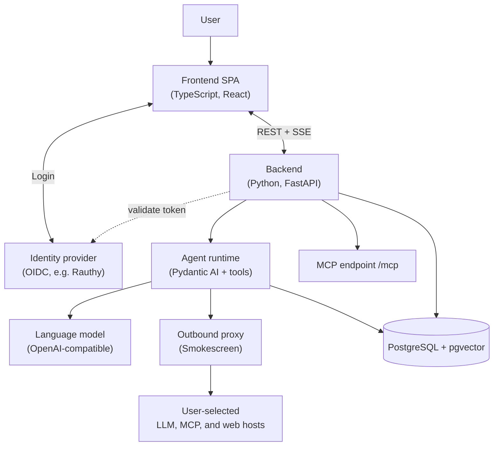

# Architecture

Hivegent is one application split into a browser frontend and a backend service, backed by a database and an identity provider.
The frontend stays thin and defers the real work to the backend, which is the composition root for login, retrieval, tool use, and model execution.

## Components

- Frontend: a React single-page app that runs in the browser.
  It handles login, the chat and document workspaces, and the streaming of responses.
- Backend: a FastAPI service that is the heart of the system.
  It authenticates every request, runs the agent, performs retrieval, and talks to the language model.
- Agent runtime: built on Pydantic AI.
  It binds the model with a set of tools (document search, reading, web lookup, memory, sub-agents) and decides which to use for each request.
- PostgreSQL with the pgvector extension: the single datastore.
  It holds the document index, chunk text and embeddings, conversations, and long-term memory.
  The document files themselves live on disk, and the database is an index over them.
- Identity provider: an external OIDC login service such as Rauthy, Keycloak, or Authentik.
  The browser logs in there, the backend validates the issued tokens, and group and admin permissions are read from the token claims.
- Language model: any OpenAI-compatible endpoint, hosted or local.
- Outbound proxy: Smokescreen resolves and connects to every user or model-controlled destination while rejecting private and reserved addresses.
  The backend still applies separate hostname allowlists to user endpoints and web tools on every request and redirect.
  Operator-configured services use direct clients and do not pass through this trust boundary.

## Interfaces

- REST: standard create, read, update, and delete for documents, conversations, and settings.
- Streaming chat: chat responses stream to the browser using the Vercel AI Data Stream protocol, and long uploads report progress over Server-Sent Events.
- MCP: an optional Model Context Protocol endpoint at `/mcp` lets external clients such as editors or other agents use a subset of Hivegent's tools through the same login.

## Deployment

The published container image bundles the backend, the built frontend, the Caddy inbound proxy, and the Smokescreen outbound proxy.
A typical deployment is therefore three containers: the Hivegent app, PostgreSQL, and the identity provider.
See [Setup](setup.md) for the details.
