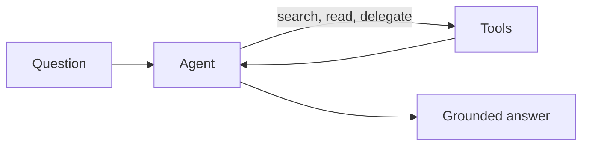

# How Hivegent Works

Hivegent is an agentic, retrieval-augmented assistant.
This page explains what that means, how it compares to simpler setups, and which tools the assistant can use.

## Three ways to ask questions about documents

**Chat with attached files.**
You attach a handful of files to a chat and the model reads them directly.
This is fine for a few short documents, but it does not scale: large or numerous documents do not fit into the model's context, there is no real search, and the model only ever sees what you attached in that session.

**Classical RAG.**
A fixed pipeline runs one search per question, pastes the top matching passages into the prompt, and answers in a single shot.
This scales to large collections and grounds answers in sources, but the single retrieval step is the whole strategy: if that one search misses, the answer suffers, and the model cannot look again, read a full document, or combine several searches.

**Agentic RAG, the Hivegent approach.**
The model acts as an agent that decides how to find the answer.
It can search repeatedly, refine its queries, read whole documents or specific lines, follow leads, delegate sub-tasks, and take several steps before it responds.
Retrieval becomes a tool the agent reaches for as needed rather than a fixed step that runs once, so it copes with vague or multi-part questions and with answers spread across many documents, while still citing its sources.

|                                | Chat with attached files       | Classical RAG               | Agentic RAG (Hivegent)                      |
| ------------------------------ | ------------------------------ | --------------------------- | ------------------------------------------- |
| Document scale                 | A few small files              | Large collections           | Large collections                           |
| Finding information            | Model reads everything attached | One fixed search per question | Agent searches and reads over several steps |
| Follow-up and refinement       | None                           | None                        | The agent decides to look again             |
| Source citations               | Sometimes                      | Yes                         | Yes                                         |
| Shared, persistent collections | No                             | Varies                      | Yes, with access control                    |

## What the assistant can do

The agent works through a set of tools, grouped into toolsets, and chooses which to use for each request.

| Toolset                | What it lets the assistant do                                                              | Availability               |
| ---------------------- | ----------------------------------------------------------------------------------------- | -------------------------- |
| Search and read        | Search your documents by meaning or exact text and open whole documents or single passages | Always                     |
| Delegated exploration  | Spin off focused sub-agents to explore documents, past conversations, or the web and report back | Always                |
| Conversation history   | Look back over earlier conversations to reuse what was already established                 | Always                     |
| Memory                 | Save useful facts to recall in later conversations                                        | Always                     |
| Document editing       | Create or edit documents in your workspace, asking for your approval first                 | Always                     |
| Web                    | Search the web and fetch pages                                                             | When enabled by the operator |
